# `Practica Final  Jenkins:`

## [🔸JENKINS:](https://www.jenkins.io/)


- ### ¿Qué es Jenkinsfile?
    - Jenkins es un sistema de integración continua (CI) de código abierto que se utiliza para automatizar tareas de desarrollo de software, como la compilación, pruebas y despliegue. Permite a los desarrolladores crear flujos de trabajo personalizados para verificar y lanzar código de manera constante y eficiente, lo que ayuda a garantizar la calidad y la entrega rápida de software. Jenkins también ofrece una amplia variedad de plugins para integrarse con diferentes herramientas de desarrollo y sistemas operativos.

- ### ¿Qué se puede hacer con Jenkins?
    - Jenkins nos permite automatizar diversas tareas que nos permiten reducir el tiempo de lanzamiento de nuestros productos digitales o sus nuevas versiones. En específico, con esta herramienta podemos:
      -  `Automatizar` la compilación y testeo de software.
      -  `Notificar a los equipos` correspondientes la detección de errores.
      - `Desplegar los cambios` en el código que hayan sido validados.
      - Hacer un `seguimiento de la calidad del código` y de la cobertura de las pruebas.
      - Generar la `documentación` de un proyecto.

- ### ¿Cómo funciona Jenkins?
    1. Un desarrollador realiza una actualización en el repositorio de código fuente.
    2. El servidor de Jenkins monitorea constantemente el repositorio en busca de cambios.
    3. Después del commit, Jenkins detecta los cambios realizados en el código fuente, lo compila y prepara una versión. Si la versión falla, se envía una notificación al equipo. Si es exitosa, se implementa en el servidor de pruebas.
    4. Después de las pruebas, Jenkins brinda un informe y notifica al equipo sobre la versión y los resultados de las pruebas.
    5. Jenkins continúa revisando regularmente el repositorio y el proceso se repite constantemente.

        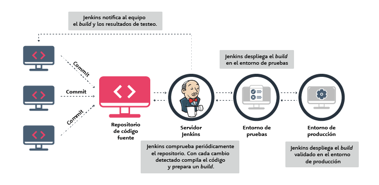
---
## [🔸Creación de la Pipeline para el proyecto:](https://onthedock.github.io/post/180521-pipeline-creacion-del-job-en-jenkins/)

- Para comenzar, configuraremos la Pipeline en Jenkins. Primero, agregaremos la URL del repositorio privado de GitHub y especificaremos las credenciales del Token para garantizar el acceso autorizado:

    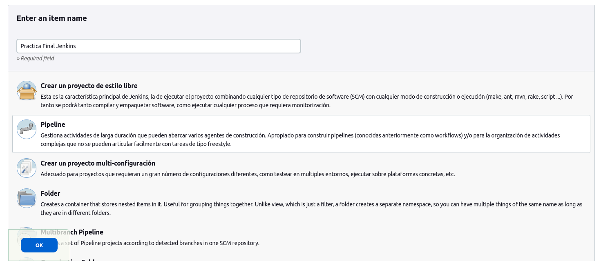
    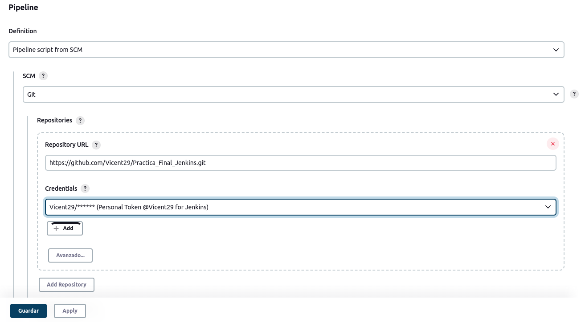

- A continuación, especificaremos la rama en la que deseamos que actúe la pipeline, en este caso será "ci_jenkins":

    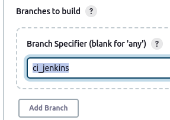
---

## [🔸Creación aplicación con Rect:](https://jenkins-react-poligons-vicent29.vercel.app/)

- A continuación, crearemos una aplicación en React que simplemente se encargará de calcular el área de polígonos. A continuación, podemos ver la página principal, aunque para ver el desarrollo completo de la aplicación, en la sección de Vercel más abajo explico cómo acceder a ella o haciendo clic [aquí](https://jenkins-react-poligons-vicent29.vercel.app/).

    
---

## `Creación del Jenkinsfile`

## 🔹Stage '[Petición de Datos](https://github.com/Vicent29/Practica_Final_Jenkins/blob/ci_jenkins/Jenkinsfile)':
- Primero, creamos el "Stage de Petición de Datos" que solicitará tres valores a través de la pantalla. Para garantizar su correcto funcionamiento, hemos agregado tres "echos" para verificar los tres parámetros.

    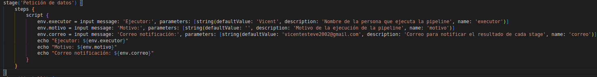

- Posteriormente, he verificado que la realización fue correcta y que los inputs funcionan de manera adecuada:

    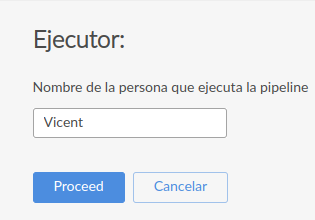
    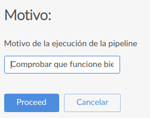
    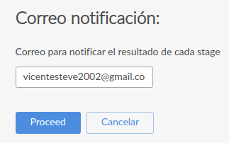
    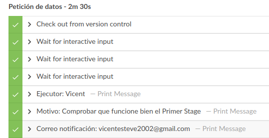

---
## 🔸[Instalación plugin Build Monitor View:](https://plugins.jenkins.io/build-monitor-plugin/)

- A continuación, procederemos a instalar el plugin "[Build Monitor View](https://plugins.jenkins.io/build-monitor-plugin/)" en Jenkins. Para ello, nos dirigiremos a "Administrar Jenkins" y seleccionaremos "Administrar Plugins".
     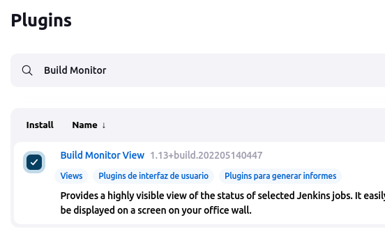

- Continuamos con crear una vista en la que podamos ver todas las tareas que hemos creado hasta el momento y su respectivo estado. Para ello, primero debemos acceder a la sección "Mis Vistas" en nuestro panel. Una vez allí, podemos crear una nueva vista haciendo clic en el botón correspondiente. Después, podemos darle un nombre a nuestra nueva vista y seleccionar las tareas o jobs  que queremos incluir en ella. Finalmente, guardamos la vista y ya podremos ver todas nuestras tareas en un solo lugar.

    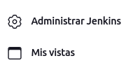
    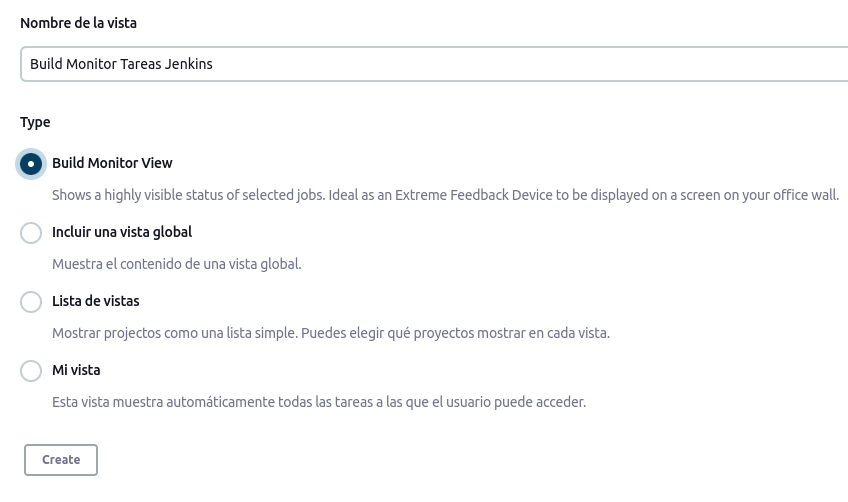
    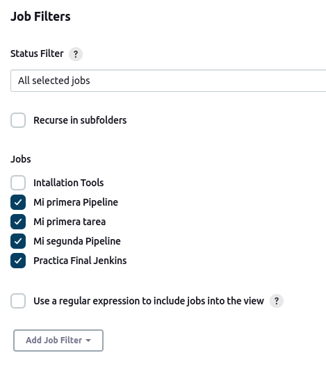
    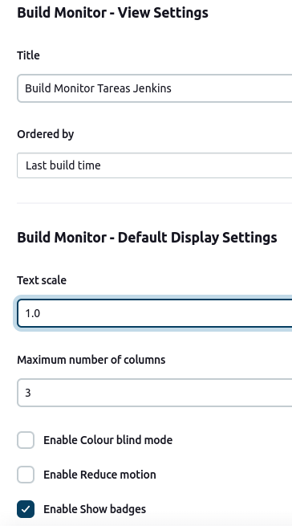

- Finalmente, el resultado de la vista será la siguiente:
    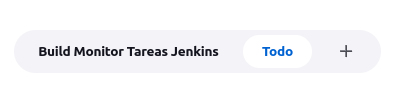
    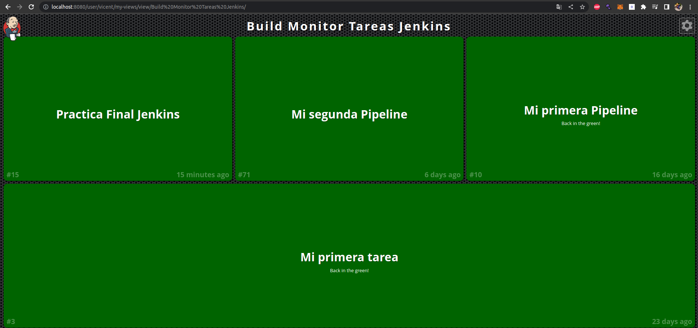

---
## 🔹Stage '[Linter](https://github.com/Vicent29/Practica_Final_Jenkins/blob/ci_jenkins/Jenkinsfile)' :

- Para comenzar, instalé y configuré el “[ESLint](https://eslint.org/)”. Además, agregué la configuración correspondiente en el archivo "[package.json](https://github.com/Vicent29/Practica_Final_Jenkins/blob/ci_jenkins/package.json)", que en mi caso fue la configuración predeterminada.
    ``` js
    npm install eslint eslint-plugin-react --save-dev
    ```
    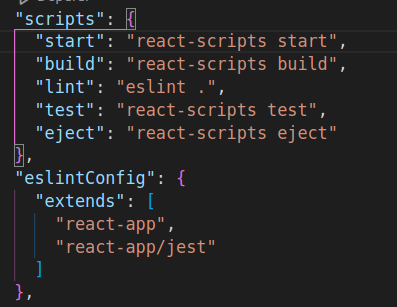

- Para verificar el correcto funcionamiento, agregué una constante no utilizada en el archivo [app.js](https://github.com/Vicent29/Practica_Final_Jenkins/blob/ci_jenkins/src/App.js) y al ejecutar el comando 'npx eslint .', obtuve el siguiente resultado:

    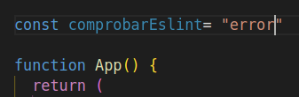

    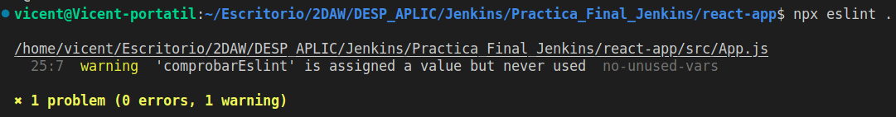

- Una vez que se ha completado la configuración y se ha comprobado que funciona correctamente, se ha creado el Stage (“Linter”). El único aspecto a tener en cuenta es que se utilizará el plugin de “[nodejs](https://plugins.jenkins.io/nodejs/)” y su correspondiente configuración . Otra opción sería tener node instalado en Jenkins, pero sería más adecuado utilizar el plugin solo en aquellos stages que sean estrictamente necesarios.
    - Instalación y configuración Plugin NodeJS:

        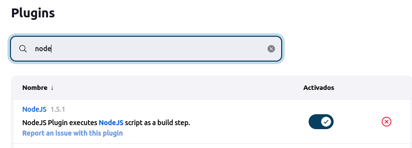
        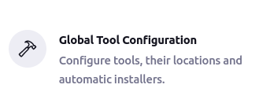
        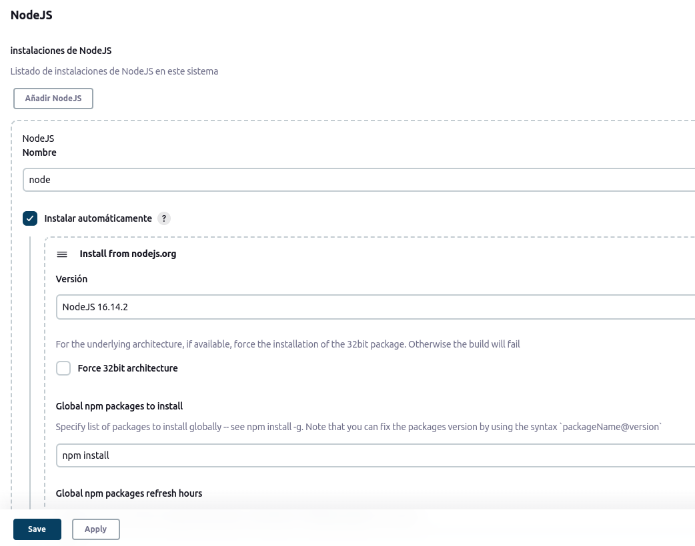
        
    - Añadiremos el plugin  al [Jenkinsfile](https://github.com/Vicent29/Practica_Final_Jenkins/blob/ci_jenkins/Jenkinsfile), para que lo utilicen los stages que lo requieran:

        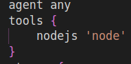
    
    - Resultado Stage:

        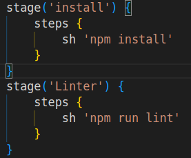

- Finalmente, el resultado del análisis del Linter será satisfactorio si todo ha cumplido con las reglas establecidas por el Linter.

  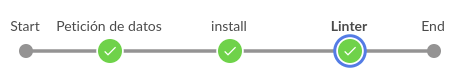
  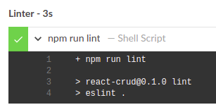
---
## 🔹Stage '[Test](https://github.com/Vicent29/Practica_Final_Jenkins/blob/ci_jenkins/Jenkinsfile)' :

- En primer lugar, es necesario instalar Jest:
    ```js
    npm install --save-dev jest
    ```
- Luego, he creado una carpeta para los [test](https://github.com/Vicent29/Practica_Final_Jenkins/tree/ci_jenkins/src/test) dentro de la carpeta /src, lo que es crucial para poder acceder a ellos. Además, crearemos tres funciones para calcular el área de cada uno de los polígonos ([Triangulo](https://github.com/Vicent29/Practica_Final_Jenkins/blob/ci_jenkins/src/test/CalcTriangulo.js), [Circulo](https://github.com/Vicent29/Practica_Final_Jenkins/blob/ci_jenkins/src/test/CalcCirculo.js), [Cuadrado](https://github.com/Vicent29/Practica_Final_Jenkins/blob/ci_jenkins/src/test/CalcCuadrado.js))  que utilizamos en nuestra aplicación de React. De esta manera, podremos utilizar la misma función tanto para verificar los tests como para el funcionamiento de la aplicación en sí.

    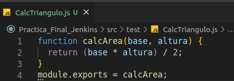
    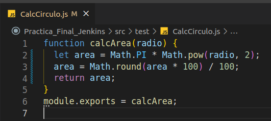
    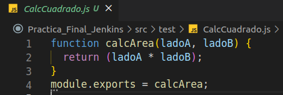

- Posteriormente, crearemos el archivo "[api.test.js](https://github.com/Vicent29/Practica_Final_Jenkins/blob/ci_jenkins/src/test/api.test.js)" dentro de la carpeta de test, que será responsable de ejecutar los test y verificar que funcionen correctamente.

    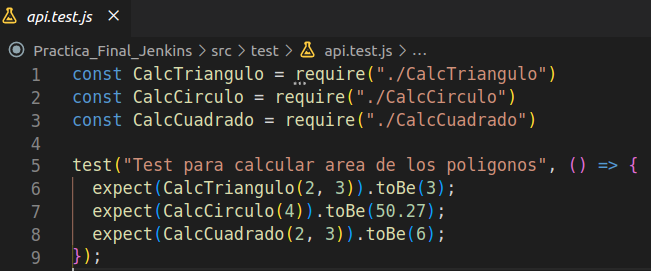

- Finalmente, he creado el stage (“Test”) que será el encargado de ejecutar el “[api.test.js](https://github.com/Vicent29/Practica_Final_Jenkins/blob/ci_jenkins/src/test/api.test.js)” y he verificado que funciona de manera adecuada.

    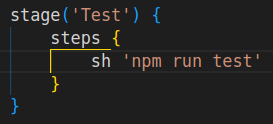
    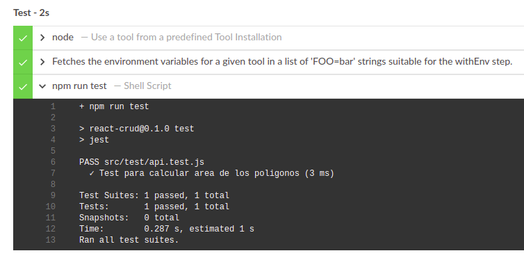

---
## 🔹Stage '[Build](https://github.com/Vicent29/Practica_Final_Jenkins/blob/ci_jenkins/Jenkinsfile)' :

- He creado un nuevo stage (denominado "Build") que se encargará de generar una versión empaquetada del proyecto. Esta versión será la utilizada para publicar el proyecto en Vercel.

  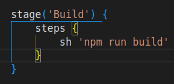

- Resultado de la build:
  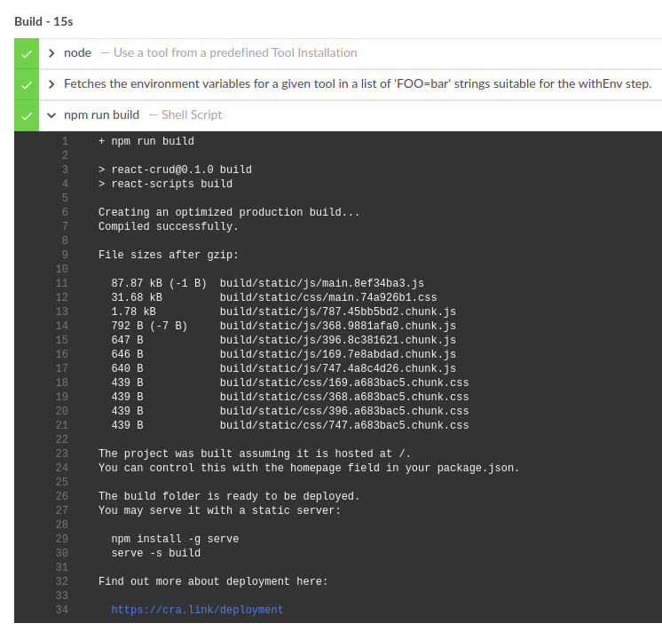

---
## 🔹Stage '[Update readme](https://github.com/Vicent32/Practica_Final_Jenkins/blob/ci_jenkins/Jenkinsfile)' :

- En primer lugar, he creado una carpeta llamada "[jenkinsScripts](https://github.com/Vicent29/Practica_Final_Jenkins/tree/ci_jenkins/jenkinsScripts)" y un archivo de script llamado "[Update_Readme.js](https://github.com/Vicent29/Practica_Final_Jenkins/blob/ci_jenkins/jenkinsScripts/Updated_Readme.js)". Este script se encargará de leer el contenido actual del archivo [README](https://github.com/Vicent29/Practica_Final_Jenkins/blob/ci_jenkins/README.md) y actualizar el estado del badge en base a los resultados de los tests de Jest.

- Ademas, para poder obtener el resultado de los tests, he modificado el Stage de "Test" igualandolo a la variable "`env.StatusTest`"
    ```js
   script{
        env.StatusTest = sh(script:'npm run test' returnStatus:true) 
    }
    ```

- El script recibirá un parámetro (0 o 1), que indicará si los tests han fallado o han sido exitosos. En consecuencia, el badge será actualizado a "[test-failure](https://img.shields.io/badge/test-failure-red)" o "[test-success](https://img.shields.io/badge/test-succes-green)".

    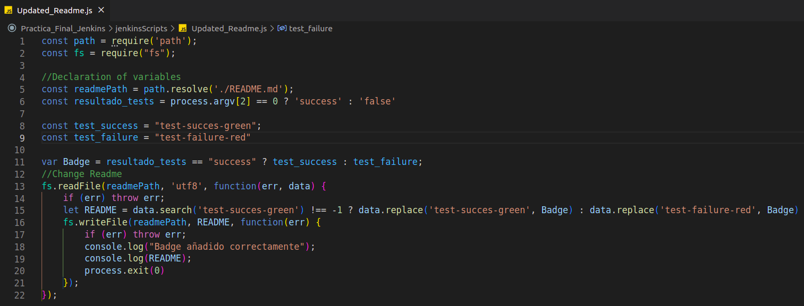

- He incluido un Badge de “test-failure” en el archivo Readme para que, cuando los tests se ejecuten correctamente, puedas ver cómo cambia su estado.

    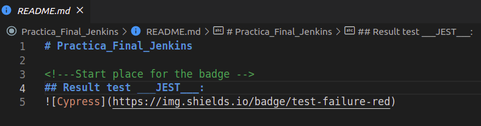

- Finalmente, he creado el stage en el Jenkinsfile para ejecutar el script mencionado en un paso previo. Además, he modificado el stage de “Test” para poder almacenar el resultado de los mismos en una variable (env.StatusTest). Para verificar que los cambios se hayan realizado correctamente, he realizado un push. Debido a que aún no tenemos un stage que realice un push al repositorio, he incluido una sentencia console.log para mostrar el contenido que será incluido en el archivo Readme.md.

    
    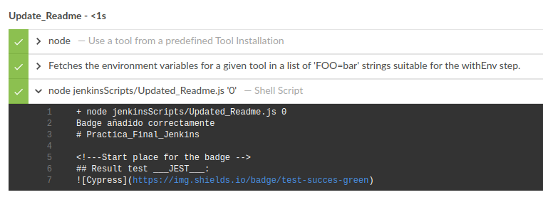

---
## 🔹Stage '[Push_Changes](https://github.com/Vicent29/Practica_Final_Jenkins/blob/ci_jenkins/Jenkinsfile)' :

- Para comenzar, crearemos un script en "[jenkinsScripts](https://github.com/Vicent29/Practica_Final_Jenkins/tree/ci_jenkins/jenkinsScripts)" con el nombre "[push_changes.sh](https://github.com/Vicent29/Practica_Final_Jenkins/blob/ci_jenkins/jenkinsScripts/push_changes.sh)". Este script se encargará de realizar una operación de "`add`, `commit`, `remote` y `push`". Además, es necesario configurar el correo electrónico y el nombre de usuario de GitHub para que pueda acceder al repositorio. Para ello, deberemos pasarle las variables (email, username, url).

    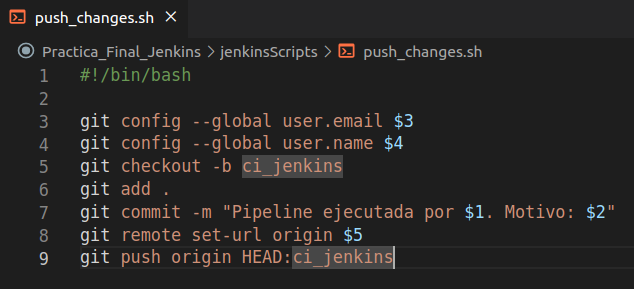

- A continuación, configuraremos las variables o credenciales necesarias en Jenkins que serán utilizadas en el script previo.

    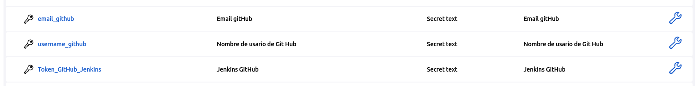 

- Posteriormente, agregaremos las variables en el archivo "[Jenkinsfile](https://github.com/Vicent29/Practica_Final_Jenkins/blob/ci_jenkins/Jenkinsfile)" creando así las environments correspondientes:

    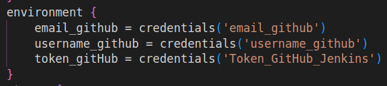

- Finalmente, estableceremos el Stage de Push_Changes, cuya función será ejecutar el Script "[push_changes.sh](https://github.com/Vicent29/Practica_Final_Jenkins/blob/ci_jenkins/jenkinsScripts/push_changes.sh)". Además, realizaremos pruebas para asegurarnos de que el Stage está funcionando adecuadamente.

    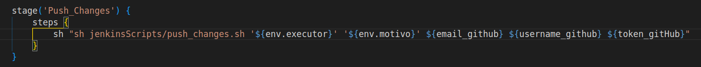
    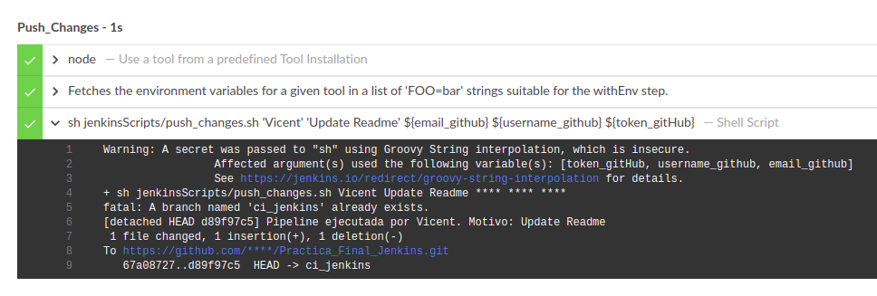
    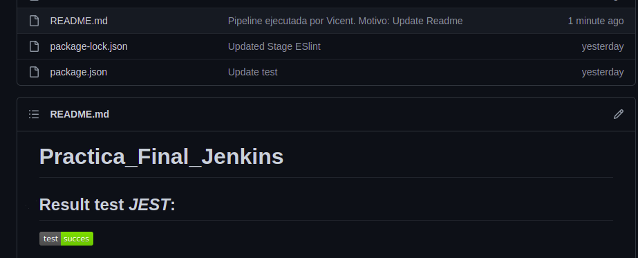
    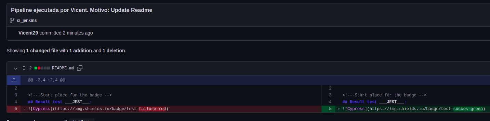

---
## 🔹Stage '[Deploy to Vercel](https://github.com/Vicent29/Practica_Final_Jenkins/blob/ci_jenkins/Jenkinsfile)' :

- Para empezar crearemos el proyecto en [Vercel](https://vercel.com/), el cual configuraremos con la url del repositorio de GitHub y la branch de “ci_jenkins”

    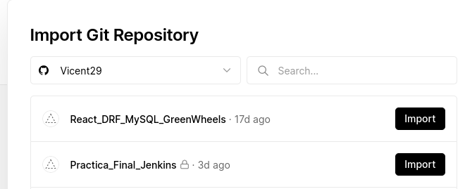
    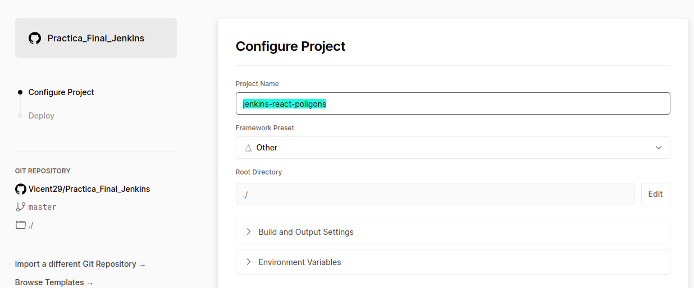
    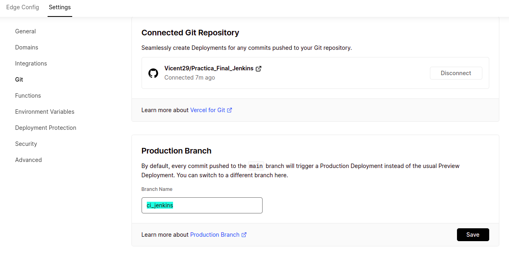
    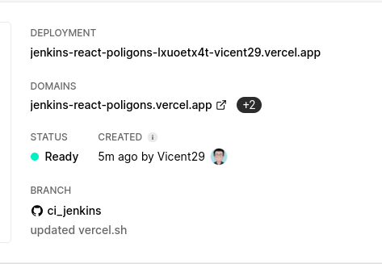  

- Seguidamente, crearemos el Token de vercel y más tarde lo añadiremos a las credenciales en Jenkins, que la utilizaré más adelante en el [Script](https://github.com/Vicent29/Practica_Final_Jenkins/blob/ci_jenkins/jenkinsScripts/deploy_vercel.sh). Ademas crearemos la environment en el [Jenkinsfile]():
     
    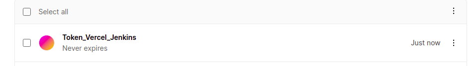
    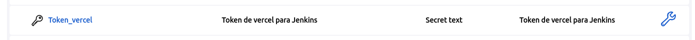
    

- Después, crearemos un stage llamado "Deploy to Vercel" que será responsable de ejecutar el script de despliegue del proyecto en Vercel. También necesitaremos instalar Vercel en Jenkins, que podemos hacer dentro del propio stage utilizando el comando `npm i -g vercel`. Sin embargo, es importante destacar que el script no se ejecutará hasta que todos los otros stages se hayan completado correctamente. Para verificar esto, primero asignaremos cada uno de los stages a una variable y luego las pasaremos al script. Si estas variables son iguales a 0, significa que todos los stages han sido completados satisfactoriamente y  se desplegará el deploy de vercel.

    

- Luego, construiremos el script mencionado anteriormente en la carpeta /jenkinsScripts y lo llamaremos "[deploy_vercel.sh](https://github.com/Vicent29/Practica_Final_Jenkins/blob/ci_jenkins/jenkinsScripts/deploy_vercel.sh)".

    

- Finalmente, comprobaremos que el Stage funciona correctamente y que se despliega correctamente el proyecto en Vercel:

    

- Para poder ver el despliegue del proyecto en Vercel:
[PROYECTO REACT VERCEL](https://jenkins-react-poligons-vicent29.vercel.app/)

---
## 🔹Stage '[Notification](https://github.com/Vicent29/Practica_Final_Jenkins/blob/ci_jenkins/Jenkinsfile)' :

- Para realizar este stage utilizare [Mailgun](https://www.mailgun.com/) (es un proveedor de servicios de correo electrónico y gestión de envíos que permite enviar y recibir correos masivos de manera segura y escalable.) 

- Para comenzar, vamos a configurar las credenciales de Jenkins. Para ello, necesitaremos utilizar Mailgun, por lo que tendremos que proporcionar dos elementos clave: la `dirección de dominio` y la `clave API`. Con estos datos, podremos establecer una conexión segura y efectiva entre Jenkins y Mailgun, permitiéndonos llevar a cabo las tareas correspondientes de manera eficiente.

    

- A continuación, agregaremos las credenciales a los environments para que puedan ser utilizadas en la Stage.

    

- Lo siguiente a realizar será crear el [Stage](https://github.com/Vicent29/Practica_Final_Jenkins/blob/ci_jenkins/Jenkinsfile) que se encargará de ejecutar el [script](https://github.com/Vicent29/Practica_Final_Jenkins/blob/ci_jenkins/jenkinsScripts/send_notification.js) que enviará el correo electrónico a partir de mailgun, para ello tendremos que pasarle las variables de “`api_key_mailgun`” , “`domain_mailgun`", "`env.correo`”, “`env.StatusLinter`”, “`env.StatusTest`” ,“`env.StatusUpdate_Readme`”, “`env.StatusDeploy_Vercel`”

    

- Luego, construiremos un script en la carpeta [/jenkinsScripts](https://github.com/Vicent29/Practica_Final_Jenkins/tree/ci_jenkins/jenkinsScripts) y lo llamaremos "[send_notification.js](https://github.com/Vicent29/Practica_Final_Jenkins/blob/ci_jenkins/jenkinsScripts/send_notification.js)". Este script se encargará de enviar el resultado de los stage en un correo, en función de los parámetros que se le pasen. Si el parámetro es 0, el resultado será “success” y si es 1, el resultado será “failure”.

    [SEND NOTIFICATION](https://github.com/Vicent29/Practica_Final_Jenkins/blob/ci_jenkins/jenkinsScripts/send_notification.js)

- Finalmente, comprobaremos que el Stage está funcionando correctamente y que recibo el email con el resultado de los Stages anteriores:

    
    

<!---Start place for the badge -->
## Result test ___JEST___:


